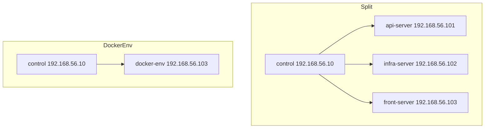

# TID Issuer Vagrant Lab

Vagrant environment for running the platform locally in two scenarios.

## Scenarios

Split scenario (`TID_SCENARIO=split`):

- `control` (`192.168.56.10`)
- `api-server` (`192.168.56.101`)
- `infra-server` (`192.168.56.102`)
- `front-server` (`192.168.56.103`)

Single-host scenario (`TID_SCENARIO=docker-env`):

- `control` (`192.168.56.10`)
- `docker-env` (`192.168.56.103`)

All VMs use `ubuntu/jammy64`.



## Prerequisites

- Vagrant
- VirtualBox
- `vagrant-hostmanager` plugin

## Run

Split:

```bash
TID_SCENARIO=split vagrant up
TID_SCENARIO=split vagrant status
TID_SCENARIO=split vagrant ssh control
```

Docker-env:

```bash
TID_SCENARIO=docker-env vagrant up
TID_SCENARIO=docker-env vagrant status
TID_SCENARIO=docker-env vagrant ssh control
```

## Switch Between Scenarios

`front-server` and `docker-env` share `192.168.56.103`, so stop or destroy before switching.

```bash
TID_SCENARIO=split vagrant destroy -f
TID_SCENARIO=docker-env vagrant destroy -f
```

## Deploy From Control VM

Inside `tid-issuer-ansible`:

Split:

```bash
ansible-playbook playbooks/site.yml --ask-vault-pass -e @group_vars/secrets.vault.yml
```

Docker-env:

```bash
ansible-playbook playbooks/docker-env.yml --ask-vault-pass -e @group_vars/secrets.vault.yml
```

## SSH Bootstrapping

`scripts/key.sh` creates a control keypair and adds the public key to target VMs for passwordless SSH.
